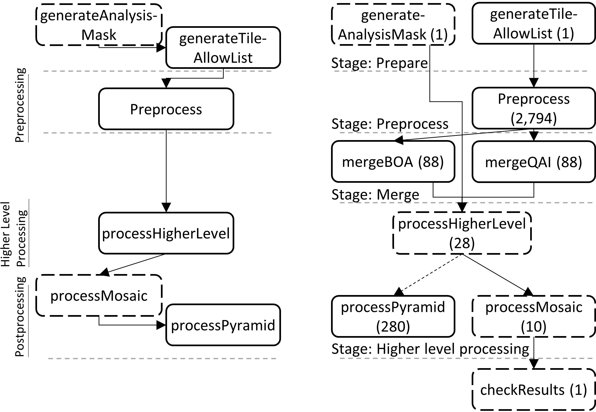

# FORCE on Nextflow: Scalable Analysis of Earth Observation data on Commodity Clusters

## Long-term vegetation dynamics in the Mediterranean

This repository focuses on a specific workflow to re-assess the widespread rangeland degradation in the Mediterranean as reported 20 years ago with limited input data. With the unlimited data access of today, however, we found that total vegetation on the island of Crete, Greece, did rather increase. Yet, we still cannot dispel that vegetation degradation occurred as most increase in vegetation cover was found in the woody vegetation, which potentially represents a degradation process related to the increase of impalatable species.

This repository offers two implementations of the workflow. The [original one](originalWF/force-original.sh) in standalone FORCE and a [ported one](nextflowWF/workflow-dsl2.nf) in FORCE on Nextflow.
We refer to the thematic workflow paper itself: [in preparation](abc), and [our paper](abc) comparing the different implementations. 

<p align="center">
  
</p>

*DAGs: The left DAG represents the original implementation in FORCE, right DAG the ported Version in Nextflow. Boxes represent processes and arrows their execution order (left) or mutual dependencies (right). Solid arrows mean that a parent task must finish completely before the dependent task can start, whereas dashed arrows indicate that a dependent task can start as soon as a first data item has been processed by the parent. Solid boxed mark CPU-, dashed boxes IO-bound tasks. Numbers in brackets represent the number of executions.*

Before you start, make sure you installed:
- [FORCE](https://davidfrantz.github.io/code/force/)
- [Nextflow](https://www.nextflow.io/)

*The workflow itself uses [FORCE in Docker](https://force-eo.readthedocs.io/en/latest/setup/docker.html). However, you may use FORCE to download necessary input data.*

To run on Kubernetes:
- [Kubectl](https://kubernetes.io/docs/reference/kubectl/overview/)

To run in Docker:
- [Docker](https://www.docker.com/) 


### Download input data
To execute both workflows, the following data are required ([filelist](experiment/filelist.txt)).
Smaller datasets are already included in this repository:
```
cd inputdata
```
#### Water Vapor Database (wvdb):
```
wget -O wvp-global.tar.gz https://zenodo.org/record/4468701/files/wvp-global.tar.gz?download=1
tar -xzf wvp-global.tar.gz --directory wvdb/
rm wvp-global.tar.gz
```
#### Landsat observations: 
```
cd download
mkdir -p meta
force-level1-csd -u -s "LND04 LND05 LND07" meta
mkdir -p data
force-level1-csd -s "LND04 LND05 LND07" -d "19840101,20061231" -c 0,70 meta/ data/ queue.txt vector/aoi.gpkg
```
*For the original workflow, the file queue (``queue.txt``), needs to hold filenames relative to ``/data/input/``, which is the mountpoint of the ``inputdata`` directory within the Docker container (i.e., ``-v path-to-repo/inputdata:/data/input``);  [see this example](https://github.com/CRC-FONDA/FORCE2NXF-Rangeland/blob/main/inputdata/download/data/queue.txt).*

### Execute workflow

#### Original workflow

Adjust input and output pathes to your needs.
You will also need to adapt parallelization parameters in [force-l2ps-param.sh, ll. 28-30](https://github.com/CRC-FONDA/FORCE2NXF-Rangeland/blob/main/originalWF/force-l2ps-param.sh) and [force-hlps-param.sh, ll. 22-24](https://github.com/CRC-FONDA/FORCE2NXF-Rangeland/blob/main/originalWF/force-hlps-param.sh) to settings that will work on your machine.
```
time originalWF/force-original.sh $PWD/inputdata $PWD/outputdata &> outputdata/stdout.log
```

#### Nextflow workflow
##### Local
```
cd nextflowWF
nextflow run workflow-dsl2.nf \
-c nextflow.config \
--inputdata ../inputdata \
--outdata ../outputdata \
--groupSize 100 \
--forceVer 3.6.5 \
-with-report ../outputdata/report.html
```
##### Kubernetes
1. Setup a user role
```
kubectl -f kubernetes/nextflow-pod-role.yaml
kubectl -f kubernetes/nextflow-role-binding.yaml
```
2. setup a read-write-many storage, in the following: ceph-fs-volume
```
kubectl -f kubernetes/ceph-fs.yaml
```
3. setup a data storage (read-many +), in the following: datasets
 - repeat the last step with a new volume, or upload your data in the created one
4. clone this repository in the root directory of the ceph-fs-volume
```
kubectl -f kubernetes/ceph-pod.yaml
kubectl exec ceph-pod -it -n default -- /bin/bash
cd /workdir
git clone https://github.com/CRC-FONDA/FORCE2NXF-Rangeland.git
```
5. adjust the [nextflow.config](nextflowWF/nextflow.config) according to your needs

6. run Nextflow workflow
```
cd nextflowWF
nextflow kuberun /workdir/FORCE2NXF-Rangeland/nextflowWF/workflow-dsl2.nf \ #cloned repository from git
-c nextflow.config \
-v ceph-fs-volume:/workdir \ # mount the read-write-many volume
-v datasets:/data \ # mount the input data
-profile kubernetesConf \
-queue-size 100 \
--inputdata /data/ \ # root directory where all input data is stored: dem, wvdb, download/data
--outdata /workdir/output \
--groupSize 100 \ # grouping x elements in the merge stage
--forceVer 3.6.5 \
-pod-image fabianlehmann/nextflow:connectionResetFix \ # use Nextflow version with our fixes
-with-report /workdir/output/report.html
```

### Experiments

We performed two types of experiments to investigate whether the ported workflow scales as expected and to detect potential bottlenecks. We first ran the original workflow in its original environment to obtain confirmed results and ensured that all other configurations produce the same results. We subtracted the runtime of the check-result task in the Nextflow workflow from the overall execution time, to achieve comparable results. 

Experiments were repeated three times ([Results](experiment/results)); we report the median of the measured runtimes. We measure wall-clock execution times rounded to minutes. For the distributed setting, we also report on efficiency of task executions, defined as the theoretical time obtained by dividing single node execution time through the number of nodes, divided by the observed runtime. Thus, an efficiency of 1 means perfect scaling, while an efficiency of 0.5, for instance, means that the distributed runtime is only half as good as theoretically possible. We utilized Nextflow version 21.04.0-edge with bugfixes [(Fix extended glob)](https://github.com/nextflow-io/nextflow/pull/2182) [(Fix: Connection-reset crashes the workflow)](https://github.com/nextflow-io/nextflow/pull/2174) and Kubernetes version 1.19.3.

#### Execute

We configured our Kubernetes cluster in a way we described in the previous paragraphs.

```
cd experiment/
bash startOrchestration.sh
```

#### Results

Results like traces, reports, etc. can be found in the [results](experiment/results) directory: 

#### Plots

To evaluate the results, we analyzed the traces with the [Analysis.ipynb](experiment/Analysis.ipynb). The plots generated can be found in [plots/](experiment/plots/).
